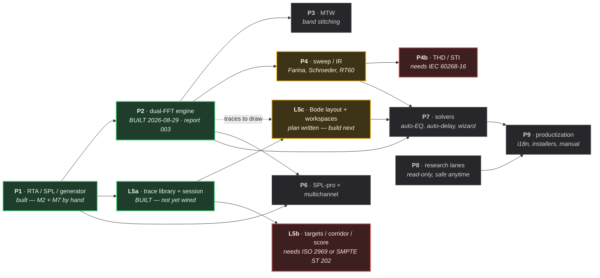

# Master execution plan — phases, dependencies, parallel lanes

*2026-08-28. The owner creates one session per lane below. Every lane follows
the five-station pipeline in docs/reports/README.md (research → analysis →
Opus plan → Sonnet build with TDD → adversarial verify → report). A lane's
session prompt is: "Read docs/plans/MASTER-EXECUTION-PLAN.md lane <X>, then
docs/reports/README.md, then the decision records it names. Continue the
pipeline from the current git state."*

## Ground truth at time of writing

*Ground truth re-measured 2026-08-28. The 103/103 figure this section carried
was two waves out of date; treat any count in a plan as a claim to re-verify,
not as a fact.*

Done (**226/226 tests**, zero /W4 warnings on a clean rebuild): core
FFT/RealFft, OctaveBands, SpectrumEngine, BandWeights, IEC 61260 FilterBank
(class 1 verified on CI), Window, RingBuffer, Synthetic signals; platform
CaptureBus/ChannelConfig/AudioIo; app measurement view model + RtaView plot +
PlotAxes + Readouts; az_ui design system; snapshot tooling. Also landed since
this section was written: Wave D (AnalysisThread, SyntheticInput, DevicePanel,
ChannelRoleTable), the Meters track (Weighting, Detector, Leq), the Generator
track (66c770c), and Wave E.

**Landed since, on `claude_desk/orchestrator-ke-nhiem-04b17b` and awaiting
merge:** `platform/AudioIo` gained its first tests at all (a JUCE-linked target
at `platform/tests_juce/`, covering five of T12's seven by-hand steps and
finding a real defect on its first run); L2 gained its decision record
(`docs/dsp/2026-08-28-dual-fft.md`); L5 was split into four records and **L5a is
built** — trace model, library, session persistence, repaint gate, cached layer
— plus a second JUCE-linked test target at `app/tests_juce/` for view code.

**Landed since that, uncommitted in this worktree (2026-08-29): L2 is BUILT.**
See `docs/reports/003-dual-fft-engine.md` for the numbers and what the
verifiers refuted; L5c also gained its decision record
(`docs/dsp/2026-08-29-display-layer-l5c.md`).

Phase 1's only open item is **T12's by-hand hardware pass**, and it is now down
to two steps rather than seven: M2 (speak into a real mic) and M7 (a physical
loopback cable). Both need a person, not another agent — see
`docs/reports/T12-hardware-run.md`. Neither blocks L2 or L5: they exercise
`platform/AudioIo` against real hardware, and no other lane touches that path.

## Dependency spine

**Green** is built. **Amber** is what to open next. **Red** is blocked on a
purchase, not on engineering. **Grey** is later.

`cepstrum / wavelet (G23)` moved OUT of P5 into the DSP lanes, because it is
DSP. Sitting it beside "draw a trace" confused two layers.

## Where the critical path actually runs

**P2 was the spine; it is now built.** `docs/reports/003-dual-fft-engine.md`
(2026-08-29): 8 tasks, 261/261 tests on a clean `RTA_BUILD_APP=OFF` rebuild, 0
warnings. P3, P4b, P6b and P7 all waited on it and are now unblocked — the
thing that made this a Smaart-class tool rather than an RTA is in the tree.
The `RTA_BUILD_APP=ON` test count was not re-measured in that session; see
`docs/HANDOFF.md`'s baseline block for the one place that number lives.

**P5 no longer blocks on P2.** L5a is built and stores measurements without
caring what produced them — its trace model is presence-based precisely so a
single-channel capture and a transfer function are the same kind of object. L5c
can wire the display up before P2 lands.

**Two purchases gate real work**, and neither can be worked around by being
clever: ISO 2969:2015 or SMPTE ST 202:2010 for the X-curve tolerance band (L5b),
and IEC 60268-16 for STI (P4b). The curve shapes are public; the tolerances are
not, and a guessed tolerance is a false Class claim.

## Lanes the owner can open as separate sessions

| Lane | Scope (decision records to read first) | Depends on | PARALLEL-SAFE with |
|---|---|---|---|
| **L2 — Dual-FFT engine** | P2: cross-spectrum, H=Sxy/Sxx, coherence, delay finder (+GCC-PHAT), phase unwrap, group delay, FIFO averaging (G1), environment input (G16). **✅ BUILT (2026-08-29), see `docs/reports/003-dual-fft-engine.md`.** Record: `docs/dsp/2026-08-28-dual-fft.md`. Uncommitted — see the report's "Nothing here is committed" section | P1 core (done) | L5, L6a, L-web. NOT with L3/L4 (same core/dsp files likely shared) |
| **L3 — MTW** | P3: decimation cascade, per-band FFT sizes, stitching, CONCURRENT with fixed engine (G2). Needs its own station-1 research pass first | L2 interface | L5, L6a |
| **L4 — Sweep/IR** | P4: Farina quick-measure mode (FR+IR one shot), ETC, Schroeder+Lundeby, EDT/T20/T30, C50/C80/D50, STI/STIPA (G4, needs IEC 60268-16), polarity checker (G21), offline dual-FFT vs WAV (G22), min/excess phase (G24), drag IR gating (G25) | P1 + generator's Sweep class | L2 partially (coordinate on core/CMakeLists — serialize integration commits), L5, L6a |
| **~~L5~~ → split into L5a/L5b/L5c** (2026-08-28). **L5a — trace library + session persistence: BUILT**, see `docs/specs/2026-08-28-trace-library-and-session.md` and its 8-task plan. **L5b — targets, corridor, coherence gate, match score**: record not written, and partly blocked on buying ISO 2969 / SMPTE ST 202 for the X-curve tolerance table. **L5c — Bode layout (G9), multi-plot workspaces (G6), spectrograph**: record written (`docs/dsp/2026-08-29-display-layer-l5c.md`) and **station 3 done — the ten-task implementation plan is at `docs/plans/2026-08-29-L5c-display-layer-impl-plan.md`**, so this lane now starts at station 4 (build). The spectrograph is explicitly OUT of that plan's scope: record §7 fixes three constraints and does not design it. The plan also absorbs, on the owner's 2026-08-29 ruling, the one thing no lane owned — **`app/` never called L2's dual-FFT engine at all**, so `measure::Snapshot` had no transfer function to draw. Nothing in `app/` implements any of it yet. L5c is also where the library finally gets wired to `RtaView` — until then the stored-trace path is built but unreached. | P1 app (done); solvers NOT needed (they are L7) | L2, L3, L4, L6a — app/ui side, disjoint from core DSP lanes |
| **~~cepstrum/wavelet (G23)~~** | **Moved OUT of L5** — it is DSP, not display, and belongs with L2/L3. Putting it beside "draw a trace" confused two layers. | L2 | — |
| **L6a — SPL-pro** | P6 subset: SPL logging/history/alarms/PDF/web viewer (G7), dose IEC 61252 (G8) | Meters track (in flight — wait for it to land) | everything except L6b |
| **L6b — Multichannel workflows** | P6 subset: spatial averaging (G14), coherence weighting (G15), sequencing + auto-discard (G20), full routing matrix, presets, remote API | L2 (multi-TF) | L4, L5 |
| **L7 — Solvers** | P7: auto-EQ + suggestions (both modes), auto-delay + suggestions, virtual processor (G11), alignment wizard (G17), crossover surface (G18), FIR export (G10) | L2 + L4 + L5 | L6a, L8 |
| **L8 — Research lanes** (each is a station-1/2 pass producing a decision record, no code until approved) | G12 SyncSource-class TF; G13 AES-75; G19 Dante/AVB/Milan; G26 DSP plug-in SDK | none (research only) | ALL — safe anytime, read-only |
| **L9 — Productization** | i18n VI/EN, installers (3 OS), website content refresh cadence, manual | everything shippable | L8 |
| **L-web — Website content package** | docs/marketing/ upkeep: re-render mockups after each landed phase, keep VI/EN copy current | none | ALL |

## Orchestration topology (owner question answered 2026-08-28)

**One orchestrator session is sufficient and preferred** — proven by the Phase-1
session itself, including three-level spawning (orchestrator → lane coordinator
→ workers; the meters lane ran its own W/D/L children and rolled results up).
The plan above plus docs/reports/README.md is the orchestrator's rulebook.

Conditions that hold regardless of topology:
1. **2-3 concurrent BUILD lanes maximum** — build directories and the two core
   CMake files are physical contention, not organizational.
2. **The orchestrator stays thin**: delegates everything, reads reports not
   files, keeps its context for judgement. When context runs low it writes the
   rule-8 handoff and the NEXT orchestrator session continues — sessions chain
   serially, they do not run in parallel on this repo.
3. **Separate sessions only for**: L-web (different repo), L8 research lanes
   (read-only, contention-free), and the successor orchestrator.

Opening prompt for the orchestrator session:
"Đọc docs/plans/MASTER-EXECUTION-PLAN.md + docs/reports/README.md +
docs/HANDOFF.md. Vận hành như orchestrator: mỗi lane một agent cấp trung theo
pipeline 5 trạm, tôn trọng cột PARALLEL-SAFE và các luật dưới đây. Giữ mình
mỏng — không tự code, không đọc file lớn, mọi claim phải qua verifier."

## Session-collision rules (from hard-won incidents this week)

1. **core/CMakeLists.txt + core/tests/CMakeLists.txt are the contention
   points.** A lane touching core serializes its ONE integration commit;
   coordinate via git pull before that commit, never via long-lived branches.
2. Each concurrent session uses its OWN build directory (build-<lane>).
   Configure core-only (default RTA_BUILD_APP=OFF) unless the lane needs JUCE.
3. Read docs/HANDOFF.md and `git log --oneline -15` at session start; the
   Seph harness flags parallel-session hazards (az-harness rules apply).
4. A lane's verifier agent gets no Write tools. Never skip station 5.

## Suggested opening order with ~2 concurrent sessions

1. ~~**L2** (the heart — Smaart-class dual-FFT), now starting at station 3 since
   its decision record landed~~ — **done, 2026-08-29** (`docs/reports/003-dual-fft-engine.md`).
2. **Now**: **L4** + **L5c** (**plan landed 2026-08-29, starts at station 4 —
   build**) + **L5b** (still blocked on the standards purchase) in parallel;
   L8 research lanes fire-and-forget anytime. L5c touches `app/`, `ui/`,
   `tools/` and one line of root `CMakeLists.txt` and **does not touch `core/`
   at all**, so it does not contend with L4 on the two core CMake files.
3. Then **L3** + **L6b**; then **L7** now that L2 is in and once L4/L5 land too;
   **L6a** after meters; **L9** last.
