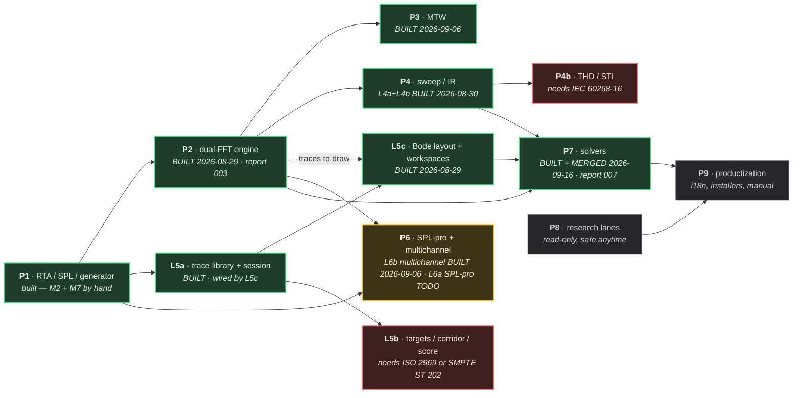

# Master execution plan — phases, dependencies, parallel lanes

*2026-08-28. The owner creates one session per lane below. Every lane follows
the five-station pipeline in docs/reports/README.md (research → analysis →
Opus plan → Sonnet build with TDD → adversarial verify → report). A lane's
session prompt is: "Read docs/plans/MASTER-EXECUTION-PLAN.md lane <X>, then
docs/reports/README.md, then the decision records it names. Continue the
pipeline from the current git state."*

## Status snapshot — 2026-09-16

**L7 (Solvers) is BUILT and MERGED. The lane is closed out —
`docs/reports/007-solvers.md`.** All five sub-lanes are on `origin/main`:
L7-OUT, L7-FIR, L7-DELAY, L7-EQ (core A–D + app E/F/G) and L7-ALIGN
(G11 + G17 + G18 with relative-polarity ρ). The last piece, ALIGN Wave 3b,
merged as **PR #9 at `6d9a53d`**. Verified by an **independent rebuild at
`6d9a53d`**: OFF **649/649**, ON **717/717**, forced fallback **649/649**,
0 `warning C`, **11/11** guards green, 8 snapshot PNGs.

**Read "BUILT" precisely: it means proven by ctest and by the offscreen
snapshot, not visible in `rtatool.exe`.** Of the whole lane only **DELAY** has
a UI (`LOCATE` / `APPLY` in `MainComponentDelay.cpp`). The G18 crossover
surface ships as a headless model plus the dev-preview specimen (**ALIGN-R8**),
and `AlignmentWizard` has no UI at all. **`MainComponent` wiring for the rest
of L7 is a follow-up that has not started** — report §3 and §7 give the
measured reference counts.

**The workflow is GitHub-oriented since 2026-09-15** (`docs/GIT-WORKFLOW.md`,
PR #1): `origin/main` is the truth, nothing lands on `main` except through a
pull request, and the local-`main`-then-push habit this document used to
describe is gone. The 36-commit local backlog was pushed `4b05049..23b7ea0`.

| PR | merge commit | what |
|---|---|---|
| #2 | `1852dff` | L7-ALIGN station-3 plan (tasks A–J, ALIGN-R1..R14) |
| #3 | `0855e8f` | L7-ALIGN order-4 phase-sign probe — settles record §13.1 |
| #4 | `a2de06e` | L7-EQ tasks E/F/G + the oversampling precision fix |
| #8 | `02bd02a` | L7-ALIGN Wave 3a, tasks A–F (core) |
| #9 | `6d9a53d` | L7-ALIGN Wave 3b, tasks G–J (app) |

Wave 0, Wave 1 (OUT, FIR) and Wave 2 (DELAY, EQ core A–D) predate the workflow
change and reached `origin/main` with that push; the local merge `a937a98` is
history, not a location to look for them.

Built + verified and on `origin/main`: **P1, P2 (L2), P3 (L3), P4 (L4a + L4b),
L5a, L5c, P6-multichannel (L6b), and the whole of P7.** Live test counts live
in `docs/HANDOFF.md`'s baseline blocks — do NOT copy them here (this doc has
twice carried a rotted number).

**Open / next:** the plan's own opening order puts **L6a (SPL-pro)** next — it
waited on the Meters track, and the Meters track landed. **L8** research lanes
are read-only and safe to fire at any time; **L9** is last. What is left of L7
is what its record deferred on purpose and what only a person can close: the ρ
threshold (two grids ran and did **not** agree, so ρ ships with **no**
threshold), where the wizard's output persists, and a real sub/main pair
measured with a rack and a microphone. **Blocked on a purchase only:** L5b
(ISO 2969 / SMPTE ST 202 X-curve tolerances) and P4b (IEC 60268-16, STI).

**GitHub Actions is billing-blocked at the account level** since after PR #5,
so `docs/GIT-WORKFLOW.md` rule 3's CI merge gate cannot be satisfied; PRs #1,
#2, #3, #4, #7, #8 and #9 merged on two locally-run configurations plus an
independent verifier. The owner restores Actions
(`docs/HUMAN-QA-QUEUE.md`, first `[!]`).

## Ground truth at time of writing

*Ground truth re-measured 2026-08-28. The 103/103 figure this section carried
was two waves out of date; treat any count in a plan as a claim to re-verify,
not as a fact. (Superseded by the Status snapshot above — kept as history.)*

Done (**226/226 tests**, zero /W4 warnings on a clean rebuild): core
FFT/RealFft, OctaveBands, SpectrumEngine, BandWeights, IEC 61260 FilterBank
(class 1 verified on CI), Window, RingBuffer, Synthetic signals; platform
CaptureBus/ChannelConfig/AudioIo; app measurement view model + RtaView plot +
PlotAxes + Readouts; az_ui design system; snapshot tooling. Also landed since
this section was written: Wave D (AnalysisThread, SyntheticInput, DevicePanel,
ChannelRoleTable), the Meters track (Weighting, Detector, Leq), the Generator
track (66c770c), and Wave E.

**Landed on `claude_desk/orchestrator-ke-nhiem-04b17b`, merged into `main` and
pushed 2026-08-29:** `platform/AudioIo` gained its first tests at all (a JUCE-linked target
at `platform/tests_juce/`, covering five of T12's seven by-hand steps and
finding a real defect on its first run); L2 gained its decision record
(`docs/dsp/2026-08-28-dual-fft.md`); L5 was split into four records and **L5a is
built** — trace model, library, session persistence, repaint gate, cached layer
— plus a second JUCE-linked test target at `app/tests_juce/` for view code.

**Landed since that (2026-08-29), committed and pushed: L2 is BUILT — and so
is L5c.** See `docs/reports/003-dual-fft-engine.md` for L2's numbers and what
the verifiers refuted, and `docs/reports/004-display-layer-l5c.md` for L5c's.
L5c's decision record is `docs/dsp/2026-08-29-display-layer-l5c.md`. **Counts
for both live in `docs/HANDOFF.md`'s baseline block and are not copied here**,
because this document has twice carried a number that had rotted.

Phase 1's only open item is **T12's by-hand hardware pass**, and it is now down
to two steps rather than seven: M2 (speak into a real mic) and M7 (a physical
loopback cable). Both need a person, not another agent — see
`docs/reports/T12-hardware-run.md`. Neither blocks L2 or L5: they exercise
`platform/AudioIo` against real hardware, and no other lane touches that path.

## Dependency spine

**Green** is built. **Amber** is what to open next. **Red** is blocked on a
purchase, not on engineering. **Grey** is later.

`cepstrum / wavelet (G23)` moved OUT of P5 into the DSP lanes, because it is
DSP. Sitting it beside "draw a trace" confused two layers.

## Where the critical path actually runs

**P2 was the spine; it is now built.** `docs/reports/003-dual-fft-engine.md`
(2026-08-29): 8 tasks, 261/261 tests on a clean `RTA_BUILD_APP=OFF` rebuild, 0
warnings. P3, P4b, P6b and P7 all waited on it and are now unblocked — the
thing that made this a Smaart-class tool rather than an RTA is in the tree.
The `RTA_BUILD_APP=ON` test count was not re-measured in that session; see
`docs/HANDOFF.md`'s baseline block for the one place that number lives.

**P5's display half is now in.** L5a's trace model is presence-based precisely
so a single-channel capture and a transfer function are the same kind of
object, and L5c proved that out: the same `StoredTraceLayer` draws magnitude
and phase, differing only by the `Field` it was constructed with. L5c also
wired the library into the app, closing the "built but unreached" item this
document and the handoff both carried.

**Two purchases gate real work**, and neither can be worked around by being
clever: ISO 2969:2015 or SMPTE ST 202:2010 for the X-curve tolerance band (L5b),
and IEC 60268-16 for STI (P4b). The curve shapes are public; the tolerances are
not, and a guessed tolerance is a false Class claim.

## Lanes the owner can open as separate sessions

| Lane | Scope (decision records to read first) | Depends on | PARALLEL-SAFE with |
|---|---|---|---|
| **L2 — Dual-FFT engine** | P2: cross-spectrum, H=Sxy/Sxx, coherence, delay finder (+GCC-PHAT), phase unwrap, group delay, FIFO averaging (G1), environment input (G16). **✅ BUILT (2026-08-29), see `docs/reports/003-dual-fft-engine.md`.** Record: `docs/dsp/2026-08-28-dual-fft.md`. Merged into `main` and pushed 2026-08-29 | P1 core (done) | L5, L6a, L-web. NOT with L3/L4 (same core/dsp files likely shared) |
| **L3 — MTW** | P3: multi-time-window transfer function, CONCURRENT with the fixed engine (G2). **✅ BUILT 2026-09-06.** Record `docs/dsp/2026-09-05-mtw-l3.md`, plan `docs/plans/2026-09-05-L3-mtw-impl-plan.md`. Decimation was **REJECTED**: the engine runs `K+1` full-rate `DualFftEngine` instances, FFT size doubling per octave downward, not a decimation cascade. Averaging is frames-uniform (`fifoDepth`, `timeConstantFrames`), with integration seconds reported per band rather than specified in seconds. MTW traces are **live-only** for now — storing them is an L5 amendment (`Trace` derives its axis from `fftSize` on purpose). Numbers live only in `docs/HANDOFF.md`'s baseline block. | L2 interface | L5, L6a |
| **L4 — Sweep/IR** — split 2026-08-30 into **L4a** (deconvolution → IR, FR, polarity; `core/`), **L4b** (ETC, Schroeder, Lundeby, RT60, clarity), **L4c** (draggable gate G25, min/excess phase G24 — **NOTE: G24's min-phase TEST folded into L7-EQ 2026-09-06 per owner; L4c retains only the time-domain min/excess-phase DISPLAY, which reuses `rta::dsp::excessPhase`/`minimumPhaseFromMagnitude`**, offline WAV G22; `app/`), **L4d** (STI, blocked on IEC 60268-16). **L4a BUILT 2026-08-30**: decisions 1-4 and 7-9 shipped; polarity (G21) shipped as decision **6b** -- decision 6's 2.5-octave bandwidth gate was refuted by its own step-0 survey and replaced by a gate on both measured band edges (low <= 100 Hz AND high >= 8 kHz). G21 tier 3 (guided sub-against-main) was AMENDED by the owner the same day and moved to G17 as a phase question. Record `docs/dsp/2026-08-30-sweep-ir-l4a.md`, plan `docs/plans/2026-08-30-L4a-sweep-ir-impl-plan.md`, state in `docs/HANDOFF.md`. Original scope: P4: Farina quick-measure mode (FR+IR one shot), ETC, Schroeder+Lundeby, EDT/T20/T30, C50/C80/D50, STI/STIPA (G4, needs IEC 60268-16), polarity checker (G21), offline dual-FFT vs WAV (G22), min/excess phase (G24), drag IR gating (G25) | P1 + generator's Sweep class | L2 partially (coordinate on core/CMakeLists — serialize integration commits), L5, L6a |
| **~~L5~~ → split into L5a/L5b/L5c** (2026-08-28). **L5a — trace library + session persistence: BUILT**, see `docs/specs/2026-08-28-trace-library-and-session.md` and its 8-task plan. **L5b — targets, corridor, coherence gate, match score**: record not written, and partly blocked on buying ISO 2969 / SMPTE ST 202 for the X-curve tolerance table. **L5c — Bode layout (G9), multi-plot workspaces (G6): ✅ BUILT 2026-08-29.** Ten tasks, 35 commits, `78ef14f..e14d0a0`. Record `docs/dsp/2026-08-29-display-layer-l5c.md` (with a §5a added mid-build for two interactions it had not decided); plan `docs/plans/2026-08-29-L5c-display-layer-impl-plan.md`. Numbers live in ONE place, `docs/HANDOFF.md`'s baseline block — do not copy them here. It also absorbed, on the owner's ruling, the thing no lane owned: **`app/` had never called L2's dual-FFT engine**, so `measure::Snapshot` carried no transfer function. That bridge is now built, and the stored-trace path this plan recorded as "built but unreached" is wired. **The spectrograph remains OUT of scope** — record §7 fixes three constraints and does not design it; it needs its own record when scheduled, and its decay-view half belongs with the IR/RT60 lane. | P1 app (done); solvers NOT needed (they are L7) | L2, L3, L4, L6a — app/ui side, disjoint from core DSP lanes |
| **~~cepstrum/wavelet (G23)~~** | **Moved OUT of L5** — it is DSP, not display, and belongs with L2/L3. Putting it beside "draw a trace" confused two layers. | L2 | — |
| **L6a — SPL-pro** | P6 subset: SPL logging/history/alarms/PDF/web viewer (G7), dose IEC 61252 (G8). **NEXT LANE (2026-09-16)** — starts at **station 1**, it has no `docs/dsp/` record yet. | ~~Meters track (in flight — wait for it to land)~~ — **the Meters track has landed** (Weighting, Detector, Leq), so this is unblocked | everything except L6b |
| **L6b — Multichannel workflows** | P6 subset: spatial averaging (G14), coherence weighting (G15), sequencing + auto-discard (G20), full routing matrix, presets, remote API. **✅ BUILT 2026-09-06** (all five stations in one orchestrator session). Record `docs/dsp/2026-09-06-multichannel-l6b.md`, research `docs/research/2026-09-06-l6b-station1-research.md`, plan `docs/plans/2026-09-06-L6b-impl-plan.md`, report `docs/reports/006-multichannel.md`. Shipped: `rta::dsp::spatialAverage` (weighted dB mean default, power option, `W = u·γ²`, circular phase mean with agreement `R`, two absence reasons), the MTW per-band variant, the overload criterion, N `Analyser`s behind a routing plan, the average as the published trace plus one solo, level align over the displayed span, a sequencer that refuses on two criteria, schema-3 presets with unbound-on-mismatch, the routing matrix view. **Not in this lane, by record §8/§10**: generator solo/mute (needs an output path that does not exist — own record) and the remote API (own record; localhost / read-only proposed). Numbers live only in `docs/HANDOFF.md`'s baseline block. | L2 (multi-TF) | L4, L5 |
| **L7 — Solvers** — **✅ BUILT 2026-09-16, MERGED. Lane report `docs/reports/007-solvers.md`.** Split 2026-09-06 into five sub-lanes; stations 1+2 DONE for all five; Wave 0 + Wave 1 + Wave 2-DELAY + Wave 2-EQ-CORE built + verified 2026-09-07 and on `origin/main` since the `4b05049..23b7ea0` push. L7-OUT (Q3-folded prerequisite — **BUILT**), L7-FIR (G10 — **BUILT**), L7-DELAY (auto-delay — **BUILT**), L7-EQ (auto-EQ, **G24 FOLDED IN**; **core A-D BUILT, app E/F BUILT 2026-09-15**), L7-ALIGN (G11 + G17 + G18, **ρ FOLDED IN** — station-3 plan `docs/plans/2026-09-15-L7-align-impl-plan.md`; **ALIGN BUILT 2026-09-16 — tasks A–J complete.** Wave 3a (A–F: the five G11 ops, `spectralCrossover`, `crossoverBandFit`, the topology table, ρ, and the two ρ surveys that ship NO threshold) merged as PR #8 at `02bd02a`, OFF 624/ON 692; Wave 3b (G–J: `VirtualTrace`, the alignment wizard, the G18 crossover surface with its specimen, and the guards shown red-then-green in both configs) **merged as PR #9 at `6d9a53d`**). **ALIGN is BUILT as MODEL + SPECIMEN — `MainComponent` wiring is a follow-up that has NOT started.** `rta::view::CrossoverSurface` is a headless, JUCE-free model whose pixels come only from `app/src/dev/preview/PhaseAlignPreview.{h,cpp}` via `rtatool_snapshot` (`shots/preview-phase.png`); it has **zero** references in `MainComponent.{h,cpp}` / `MainComponentDelay.cpp`, by decision **ALIGN-R8** ("nobody should hunt for a `MainComponent` hook"). `AlignmentWizard` has **no UI at all** — reachable only from `app/tests/`. Of the whole lane, **only DELAY is reachable from the running app** (`LOCATE` / `APPLY` in `MainComponentDelay.cpp`, task F2). **Tallies at `6d9a53d`, VERIFIER-measured by an independent rebuild: OFF 649/649, ON 717/717, forced fallback (`-DRTA_FORCE_ATOMIC_SHARED_PTR_FALLBACK=ON`) 649/649, 0 `warning C`, 11/11 guards green, 8 snapshot PNGs** — and `git diff 6d9a53d^2 6d9a53d` is empty, so they describe the merge commit's tree. Build order = **Wave 0 (MinimumPhase, FilterSpec, BiquadDesign, BiquadResponse) ✅** → **Wave 1 OUT ∥ FIR ✅ (OFF 505/ON 571)** → **Wave 2 DELAY ✅ (OFF 529/ON 597) ∥ EQ core ✅ (OFF 551) → **EQ E/F app ✅ 2026-09-15 (OFF 564/ON 632)** → **Wave 3 ALIGN ✅ 2026-09-16 (OFF 649/ON 717)**. **ρ ships with NO threshold** — two grids ran and did not agree (grid A floors at ρ > 0.0640 but a correctly-signed cell sits at 0.0520; grid B has no wrong-sign cell in 2000), so `relativePolarity` returns a bounded figure and no verdict. **Five record amendments landed and one is still owed** — see `docs/reports/007-solvers.md` §5. ✅ **G24 CAVEAT RESOLVED (proven, not refuted):** the shared `minimumPhaseFromMagnitude` 8× is adequate only because FIR windows first; EQ's G24 measured that raw measured magnitude needs **64× min, ships 128×** — `kExcessPhaseOversamplingFactor`. (Precision fix PAID 2026-09-15: 64× is driven by the tail-energy criterion, not by the swing `classifyDip` reads — swing alone converges at 8×; 128× ships unchanged. Record §4.3 amendment + `gen_autoeq_algo.py` docstring carry the per-fixture table.) Records `docs/dsp/2026-09-06-l7-*.md`, research `docs/research/2026-09-06-l7-*-station1-research.md`, state in `docs/HANDOFF.md` top entry. **G24 is NO LONGER an L4c item — its min-phase test is folded into L7-EQ.** Original scope: P7: auto-EQ + suggestions (both modes), auto-delay + suggestions, virtual processor (G11), alignment wizard (G17), crossover surface (G18), FIR export (G10). **Owner ruling 2026-09-06: the generator OUTPUT PATH (auto solo/mute, G20 — deferred out of L6b §8) is FOLDED INTO L7**, not a separate lane: every solver must play a signal, so L7 station 1 opened with the lock-free output-path research (which outputs, routing, mute without a lock, keep `audioio_scoped_no_denormals_is_first`) as a prerequisite, serving both solver excitation and G20. G17 is a PHASE question L4a moved here: the correct crossover phase offset is topology-defined (LR 0°, BW2 180°, odd-order BW 90°) and unrecoverable from measurement — the wizard must ASK topology, not guess. | L2 + L4 + L5 (all in) | L6a, L8 |
| **L8 — Research lanes** (each is a station-1/2 pass producing a decision record, no code until approved) | G12 SyncSource-class TF; G13 AES-75; G19 Dante/AVB/Milan; G26 DSP plug-in SDK | none (research only) | ALL — safe anytime, read-only |
| **L9 — Productization** | i18n VI/EN, installers (3 OS), website content refresh cadence, manual | everything shippable | L8 |
| **L-web — Website content package** | docs/marketing/ upkeep: re-render mockups after each landed phase, keep VI/EN copy current | none | ALL |

## Orchestration topology (owner question answered 2026-08-28)

**One orchestrator session is sufficient and preferred** — proven by the Phase-1
session itself, including three-level spawning (orchestrator → lane coordinator
→ workers; the meters lane ran its own W/D/L children and rolled results up).
The plan above plus docs/reports/README.md is the orchestrator's rulebook.

Conditions that hold regardless of topology:
1. **2-3 concurrent BUILD lanes maximum** — build directories and the two core
   CMake files are physical contention, not organizational.
2. **The orchestrator stays thin**: delegates everything, reads reports not
   files, keeps its context for judgement. When context runs low it writes the
   rule-8 handoff and the NEXT orchestrator session continues — sessions chain
   serially, they do not run in parallel on this repo.
3. **Separate sessions only for**: L-web (different repo), L8 research lanes
   (read-only, contention-free), and the successor orchestrator.

Opening prompt for the orchestrator session:
"Đọc docs/plans/MASTER-EXECUTION-PLAN.md + docs/reports/README.md +
docs/HANDOFF.md. Vận hành như orchestrator: mỗi lane một agent cấp trung theo
pipeline 5 trạm, tôn trọng cột PARALLEL-SAFE và các luật dưới đây. Giữ mình
mỏng — không tự code, không đọc file lớn, mọi claim phải qua verifier."

## Session-collision rules (from hard-won incidents this week)

*Superseded in part 2026-09-15 by `docs/GIT-WORKFLOW.md`: `origin/main` is the
truth, every builder works in its own `git worktree` on its own branch, and
nothing lands on `main` except through a pull request. Read that document
first; the rules below still describe the physical contention it does not.*

1. **core/CMakeLists.txt + core/tests/CMakeLists.txt are the contention
   points.** A lane touching core serializes its ONE integration commit;
   rebase or merge `origin/main` into the lane branch before opening the PR,
   never hold a long-lived branch.
2. Each concurrent session uses its OWN build directory (build-<lane>).
   Configure core-only (default RTA_BUILD_APP=OFF) unless the lane needs JUCE.
3. Read docs/HANDOFF.md and `git log --oneline -15` at session start; the
   Seph harness flags parallel-session hazards (az-harness rules apply).
4. A lane's verifier agent gets no Write tools. Never skip station 5.

## Suggested opening order with ~2 concurrent sessions

1. ~~**L2** (the heart — Smaart-class dual-FFT), now starting at station 3 since
   its decision record landed~~ — **done, 2026-08-29** (`docs/reports/003-dual-fft-engine.md`).
2. ~~**L4** + **L5c** in parallel~~ — **L5c done, 2026-08-29** (see its row
   above; it touched `app/`, `ui/`, `tools/` and one line of root
   `CMakeLists.txt`, and **not one line of `core/`**).
3. ~~**Now**: **L4** — and note it starts at **station 1**, not station 3: sweep/IR
   has no decision record yet~~ — **superseded 2026-08-30.** L4 now has a
   decision record and is split four ways. ~~**L4a is built** (Task 6 closeout in
   progress) and resumes at its Task 5, not at station 1.~~ — **L4a is CLOSED and
   MERGED**, 2026-08-30, merge commit `61daf1a`; Task 5 and Task 6 both landed.
   Read `docs/HANDOFF.md` first, then `docs/dsp/2026-08-30-sweep-ir-l4a.md`.
   **L5b** stays blocked on the ISO 2969 / SMPTE ST 202 purchase, **L4d** on
   IEC 60268-16. L8 research lanes fire-and-forget anytime.
4. ~~**Now**: **L4b**~~ — **BUILT 2026-08-30** (session EP06), `core/` only,
   ~~on `claude_desk/handoff-continuation-9045fc` and **not yet merged**~~ —
   **MERGED 2026-08-30 at `e77e0e1`** and pushed `29b464e..7122070`
   (`docs/HUMAN-QA-QUEUE.md`, "Từ lane L4b"). Record
   `docs/dsp/2026-08-30-ir-decay-l4b.md`; numbers and open items live in
   `docs/HANDOFF.md` and are not copied here. Three figures a later session must
   not re-derive: the B*T gate ships at **6, not the literature's 4** (the
   measured decay is inflated by the filter at exactly the values being gated,
   and the constant is filter-order dependent); the gate reads **T30, not
   Lundeby's working slope**; and **EDT has no validity envelope yet** and reads
   +22 to +24 % inside the region the gate admits. Still open: golden vectors,
   the "who guards what" pointers in two test files, and the RTA_BUILD_APP=ON
   count. Two mandates L4a measured and handed it are in that record's
   "What this record does not decide" — the deconvolution noise tail that reads
   as a plausible RT60 out of a measurement containing no room, and the
   relative-polarity ρ thresholds that came from one grid and must be
   re-derived before any of them ships.
5. ~~Then **L3**~~ — **BUILT 2026-09-06**, see its row above. ~~**L6b** next~~ —
   **BUILT 2026-09-06**, see its row; two pieces it scoped out need their own
   station-1 pass: the **generator output path** (auto solo/mute, and L7's
   solvers also need to play a signal) and the **remote API**. ~~Then **L7**,
   which needed L2 + L4 + L5 — two of those three are in.~~ — **L7 BUILT and
   MERGED 2026-09-16**, `docs/reports/007-solvers.md`; it absorbed the
   generator output path as its own prerequisite sub-lane (L7-OUT). The other
   piece, the **remote API**, has had a lane since 2026-09-16: its stations 1+2
   are on **PR #11** (`remote-api/stations-1-2`, head `828c223`, OPEN) — opened
   69 seconds after this closeout's head commit was authored, which is why an
   earlier revision of this line said it had none.
6. **Now: L6a (SPL-pro)** — SPL logging / history / alarms / PDF / web viewer
   (G7) and dose IEC 61252 (G8). It waited on the Meters track and the Meters
   track landed (Weighting, Detector, Leq — see "Ground truth" above), so the
   dependency column's "wait for it to land" is satisfied. It starts at
   **station 1**: there is no `docs/dsp/` record for SPL-pro yet. Read
   `docs/HANDOFF.md`'s "L7 CLOSED OUT" section first — it carries the handoff
   written for this lane. **L8** research lanes stay fire-and-forget;
   **L9** last; **L5b** and **L4d** stay blocked on their purchases.
