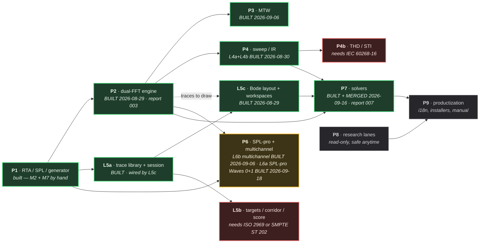

# Master execution plan — phases, dependencies, parallel lanes

*2026-08-28. The owner creates one session per lane below. Every lane follows
the five-station pipeline in docs/reports/README.md (research → analysis →
Opus plan → Sonnet build with TDD → adversarial verify → report). A lane's
session prompt is: "Read docs/plans/MASTER-EXECUTION-PLAN.md lane <X>, then
docs/reports/README.md, then the decision records it names. Continue the
pipeline from the current git state."*

## Status snapshot — 2026-09-16

**L7 (Solvers) is BUILT and MERGED. The lane is closed out —
`docs/reports/007-solvers.md`.** All five sub-lanes are on `origin/main`:
L7-OUT, L7-FIR, L7-DELAY, L7-EQ (core A–D + app E/F/G) and L7-ALIGN
(G11 + G17 + G18 with relative-polarity ρ). The last piece, ALIGN Wave 3b,
merged as **PR #9 at `6d9a53d`**. Verified by an **independent rebuild at
`6d9a53d`**: OFF **649/649**, ON **717/717**, forced fallback **649/649**,
0 `warning C`, **11/11** guards green, 8 snapshot PNGs.

**Read "BUILT" precisely: it means proven by ctest and by the offscreen
snapshot, not visible in `rtatool.exe`.** Of the whole lane only **DELAY** has
a UI (`LOCATE` / `APPLY` in `MainComponentDelay.cpp`). The G18 crossover
surface ships as a headless model plus the dev-preview specimen (**ALIGN-R8**),
and `AlignmentWizard` has no UI at all. **`MainComponent` wiring for the rest
of L7 is a follow-up that has not started** — report §3 and §7 give the
measured reference counts.

**The workflow is GitHub-oriented since 2026-09-15** (`docs/GIT-WORKFLOW.md`,
PR #1): `origin/main` is the truth, nothing lands on `main` except through a
pull request, and the local-`main`-then-push habit this document used to
describe is gone. The 36-commit local backlog was pushed `4b05049..23b7ea0`.

| PR | merge commit | what |
|---|---|---|
| #2 | `1852dff` | L7-ALIGN station-3 plan (tasks A–J, ALIGN-R1..R14) |
| #3 | `0855e8f` | L7-ALIGN order-4 phase-sign probe — settles record §13.1 |
| #4 | `a2de06e` | L7-EQ tasks E/F/G + the oversampling precision fix |
| #8 | `02bd02a` | L7-ALIGN Wave 3a, tasks A–F (core) |
| #9 | `6d9a53d` | L7-ALIGN Wave 3b, tasks G–J (app) |

Wave 0, Wave 1 (OUT, FIR) and Wave 2 (DELAY, EQ core A–D) predate the workflow
change and reached `origin/main` with that push; the local merge `a937a98` is
history, not a location to look for them.

Built + verified and on `origin/main`: **P1, P2 (L2), P3 (L3), P4 (L4a + L4b),
L5a, L5c, P6-multichannel (L6b), and the whole of P7.** Live test counts live
in `docs/HANDOFF.md`'s baseline blocks — do NOT copy them here (this doc has
twice carried a rotted number).

**Open / next: L6a (SPL-pro) stations 1+2+3 are DONE and station 4 has Waves 0+1 BUILT** (1+2 on 2026-09-16,
station 3 on 2026-09-17) — record
[`docs/dsp/2026-09-16-spl-pro-l6a.md`](../dsp/2026-09-16-spl-pro-l6a.md),
research `docs/research/2026-09-16-l6a-spl-pro-station1-research.md`, plan
[`docs/plans/2026-09-17-L6a-spl-pro-impl-plan.md`](2026-09-17-L6a-spl-pro-impl-plan.md);
**station 4 WAVE 0 is BUILT (2026-09-18) and its PR is open, not merged** -- branch
`l6a/wave0-spl-publish`. **Waves 1-4 have not started**; the
L6a row below carries the tallies, the design finding and the three falsified
tolerances. Correct one thing this paragraph used to say: L6a "waited
on the Meters track, and the Meters track landed" is true only of `core/`.
`grep -rn "rta::meter\|rta/meter"` over the whole repo returns 16 lines, every
one under `core/`; `measure::Snapshot` carries no broadband level, no weighting
and no detector. **So L6a's first wave is building the SPL publish path**, which
is also what gates `"spl"` in the remote API's `available` list. **L8** research
lanes
are read-only and safe to fire at any time; **L9** is last. What is left of L7
is what its record deferred on purpose and what only a person can close: the ρ
threshold (two grids ran and did **not** agree, so ρ ships with **no**
threshold), where the wizard's output persists, and a real sub/main pair
measured with a rack and a microphone. **Blocked on a purchase only:** L5b
(ISO 2969 / SMPTE ST 202 X-curve tolerances) and P4b (IEC 60268-16, STI).

**GitHub Actions is billing-blocked at the account level** since after PR #5,
so `docs/GIT-WORKFLOW.md` rule 3's CI merge gate cannot be satisfied; PRs #1,
#2, #3, #4, #7, #8 and #9 merged on two locally-run configurations plus an
independent verifier. The owner restores Actions
(`docs/HUMAN-QA-QUEUE.md`, first `[!]`).

## Ground truth at time of writing

*Ground truth re-measured 2026-08-28. The 103/103 figure this section carried
was two waves out of date; treat any count in a plan as a claim to re-verify,
not as a fact. (Superseded by the Status snapshot above — kept as history.)*

Done (**226/226 tests**, zero /W4 warnings on a clean rebuild): core
FFT/RealFft, OctaveBands, SpectrumEngine, BandWeights, IEC 61260 FilterBank
(class 1 verified on CI), Window, RingBuffer, Synthetic signals; platform
CaptureBus/ChannelConfig/AudioIo; app measurement view model + RtaView plot +
PlotAxes + Readouts; az_ui design system; snapshot tooling. Also landed since
this section was written: Wave D (AnalysisThread, SyntheticInput, DevicePanel,
ChannelRoleTable), the Meters track (Weighting, Detector, Leq), the Generator
track (66c770c), and Wave E.

**Landed on `claude_desk/orchestrator-ke-nhiem-04b17b`, merged into `main` and
pushed 2026-08-29:** `platform/AudioIo` gained its first tests at all (a JUCE-linked target
at `platform/tests_juce/`, covering five of T12's seven by-hand steps and
finding a real defect on its first run); L2 gained its decision record
(`docs/dsp/2026-08-28-dual-fft.md`); L5 was split into four records and **L5a is
built** — trace model, library, session persistence, repaint gate, cached layer
— plus a second JUCE-linked test target at `app/tests_juce/` for view code.

**Landed since that (2026-08-29), committed and pushed: L2 is BUILT — and so
is L5c.** See `docs/reports/003-dual-fft-engine.md` for L2's numbers and what
the verifiers refuted, and `docs/reports/004-display-layer-l5c.md` for L5c's.
L5c's decision record is `docs/dsp/2026-08-29-display-layer-l5c.md`. **Counts
for both live in `docs/HANDOFF.md`'s baseline block and are not copied here**,
because this document has twice carried a number that had rotted.

Phase 1's only open item is **T12's by-hand hardware pass**, and it is now down
to two steps rather than seven: M2 (speak into a real mic) and M7 (a physical
loopback cable). Both need a person, not another agent — see
`docs/reports/T12-hardware-run.md`. Neither blocks L2 or L5: they exercise
`platform/AudioIo` against real hardware, and no other lane touches that path.

## Dependency spine

**Green** is built. **Amber** is what to open next. **Red** is blocked on a
purchase, not on engineering. **Grey** is later.

`cepstrum / wavelet (G23)` moved OUT of P5 into the DSP lanes, because it is
DSP. Sitting it beside "draw a trace" confused two layers.

## Where the critical path actually runs

**P2 was the spine; it is now built.** `docs/reports/003-dual-fft-engine.md`
(2026-08-29): 8 tasks, 261/261 tests on a clean `RTA_BUILD_APP=OFF` rebuild, 0
warnings. P3, P4b, P6b and P7 all waited on it and are now unblocked — the
thing that made this a Smaart-class tool rather than an RTA is in the tree.
The `RTA_BUILD_APP=ON` test count was not re-measured in that session; see
`docs/HANDOFF.md`'s baseline block for the one place that number lives.

**P5's display half is now in.** L5a's trace model is presence-based precisely
so a single-channel capture and a transfer function are the same kind of
object, and L5c proved that out: the same `StoredTraceLayer` draws magnitude
and phase, differing only by the `Field` it was constructed with. L5c also
wired the library into the app, closing the "built but unreached" item this
document and the handoff both carried.

**Two purchases gate real work**, and neither can be worked around by being
clever: ISO 2969:2015 or SMPTE ST 202:2010 for the X-curve tolerance band (L5b),
and IEC 60268-16 for STI (P4b). The curve shapes are public; the tolerances are
not, and a guessed tolerance is a false Class claim.

## Lanes the owner can open as separate sessions

| Lane | Scope (decision records to read first) | Depends on | PARALLEL-SAFE with |
|---|---|---|---|
| **L2 — Dual-FFT engine** | P2: cross-spectrum, H=Sxy/Sxx, coherence, delay finder (+GCC-PHAT), phase unwrap, group delay, FIFO averaging (G1), environment input (G16). **✅ BUILT (2026-08-29), see `docs/reports/003-dual-fft-engine.md`.** Record: `docs/dsp/2026-08-28-dual-fft.md`. Merged into `main` and pushed 2026-08-29 | P1 core (done) | L5, L6a, L-web. NOT with L3/L4 (same core/dsp files likely shared) |
| **L3 — MTW** | P3: multi-time-window transfer function, CONCURRENT with the fixed engine (G2). **✅ BUILT 2026-09-06.** Record `docs/dsp/2026-09-05-mtw-l3.md`, plan `docs/plans/2026-09-05-L3-mtw-impl-plan.md`. Decimation was **REJECTED**: the engine runs `K+1` full-rate `DualFftEngine` instances, FFT size doubling per octave downward, not a decimation cascade. Averaging is frames-uniform (`fifoDepth`, `timeConstantFrames`), with integration seconds reported per band rather than specified in seconds. MTW traces are **live-only** for now — storing them is an L5 amendment (`Trace` derives its axis from `fftSize` on purpose). Numbers live only in `docs/HANDOFF.md`'s baseline block. | L2 interface | L5, L6a |
| **L4 — Sweep/IR** — split 2026-08-30 into **L4a** (deconvolution → IR, FR, polarity; `core/`), **L4b** (ETC, Schroeder, Lundeby, RT60, clarity), **L4c** (draggable gate G25, min/excess phase G24 — **NOTE: G24's min-phase TEST folded into L7-EQ 2026-09-06 per owner; L4c retains only the time-domain min/excess-phase DISPLAY, which reuses `rta::dsp::excessPhase`/`minimumPhaseFromMagnitude`**, offline WAV G22; `app/`), **L4d** (STI, blocked on IEC 60268-16). **L4a BUILT 2026-08-30**: decisions 1-4 and 7-9 shipped; polarity (G21) shipped as decision **6b** -- decision 6's 2.5-octave bandwidth gate was refuted by its own step-0 survey and replaced by a gate on both measured band edges (low <= 100 Hz AND high >= 8 kHz). G21 tier 3 (guided sub-against-main) was AMENDED by the owner the same day and moved to G17 as a phase question. Record `docs/dsp/2026-08-30-sweep-ir-l4a.md`, plan `docs/plans/2026-08-30-L4a-sweep-ir-impl-plan.md`, state in `docs/HANDOFF.md`. Original scope: P4: Farina quick-measure mode (FR+IR one shot), ETC, Schroeder+Lundeby, EDT/T20/T30, C50/C80/D50, STI/STIPA (G4, needs IEC 60268-16), polarity checker (G21), offline dual-FFT vs WAV (G22), min/excess phase (G24), drag IR gating (G25) | P1 + generator's Sweep class | L2 partially (coordinate on core/CMakeLists — serialize integration commits), L5, L6a |
| **~~L5~~ → split into L5a/L5b/L5c** (2026-08-28). **L5a — trace library + session persistence: BUILT**, see `docs/specs/2026-08-28-trace-library-and-session.md` and its 8-task plan. **L5b — targets, corridor, coherence gate, match score**: record not written, and partly blocked on buying ISO 2969 / SMPTE ST 202 for the X-curve tolerance table. **L5c — Bode layout (G9), multi-plot workspaces (G6): ✅ BUILT 2026-08-29.** Ten tasks, 35 commits, `78ef14f..e14d0a0`. Record `docs/dsp/2026-08-29-display-layer-l5c.md` (with a §5a added mid-build for two interactions it had not decided); plan `docs/plans/2026-08-29-L5c-display-layer-impl-plan.md`. Numbers live in ONE place, `docs/HANDOFF.md`'s baseline block — do not copy them here. It also absorbed, on the owner's ruling, the thing no lane owned: **`app/` had never called L2's dual-FFT engine**, so `measure::Snapshot` carried no transfer function. That bridge is now built, and the stored-trace path this plan recorded as "built but unreached" is wired. **The spectrograph remains OUT of scope** — record §7 fixes three constraints and does not design it; it needs its own record when scheduled, and its decay-view half belongs with the IR/RT60 lane. | P1 app (done); solvers NOT needed (they are L7) | L2, L3, L4, L6a — app/ui side, disjoint from core DSP lanes |
| **~~cepstrum/wavelet (G23)~~** | **Moved OUT of L5** — it is DSP, not display, and belongs with L2/L3. Putting it beside "draw a trace" confused two layers. | L2 | — |
| **L6a — SPL-pro** | P6 subset: SPL logging/history/alarms/PDF/web viewer (G7), dose IEC 61252 (G8). **Stations 1+2 DONE 2026-09-16, station 3 DONE 2026-09-17, station 4 WAVE 0 BUILT + MERGED (PR #17, `b1e14a9`) and WAVE 1 BUILT 2026-09-18** (Wave 0's branch was `l6a/wave0-spl-publish`, **verified adversarially TWICE on PR #17 and merged up to `origin/main` `7b4773f`** before merging as `b1e14a9`: OFF 747/747, ON 821/821 and forced-fallback OFF 747/747, 0 `warning C` in all three. The verifier reproduced the pre-merge 689/762/689, found four mutations red, and found THREE defects, all fixed on the branch -- the load-bearing one is that `SplConfig::metrics` was unbounded while the publish path's per-metric window storage was a fixed 16, so a 17-metric config published a C-weighted label over the A chain's number, measured 18.843 dB wrong. Round 2 found two more: the ROUTED publish branch had no test at all -- deleting its `snapshot->spl` assignment left the suite green while a routed session, which is what a rig runs during a show, would have published no SPL -- and the per-metric window array's bound was a convention rather than a gate. `docs/HANDOFF.md`'s top section carries the per-commit table, both verifier rounds and every measured residual, and is the only place they live). **WAVE 1 (the core pure math) IS BUILT** on branch `l6a/wave1-core-metrics`, six commits `9a36c24..1357948`, PR open and NOT merged: OFF **790/790** and ON **864/864** at `1357948` against 747/747 and 821/821 at `b1e14a9`, `0 warning C` in both. It ships `meter::LevelHistogram` (2000 bins of 0.1 dB + two out-of-span counters, Ln over bin CENTRES, **absence with a reason instead of clamping**, and a `w/2 = 0.05 dB` bound that is a theorem -- measured worst residual `0.050000000000011369` dB, which REACHES the bound), `Leq::sumSquares()` beside `leqDb` asserted BITWISE, record section 3's windowed recompute asserted bitwise over 3600 steps of a 900-block ring **plus the two cases that show why the O(1) running subtraction was rejected** (round-off is 4.3e-13 dB and is NOT the reason; mutable membership is -- a `CalibrationInvalid` verdict on a block still inside the window leaves a running sum 10.8 dB out), `headroomDb` as a closed form with absence when the window is already lost, `AlarmLatch` with **no hysteresis, no debounce and no margin** and a bare-double overload that is `= delete`, `meter::Dose` (one formula, `q` COMPUTED per preset, two accumulators, peak nowhere near the integral) with a two-part fixture over **222 transcribed primary-source rows**, and `SplCriteria.h` keeping the three 140s apart. **Nine mutations run, every one red**; four guards shown red-then-green with their scanned counts read from the guards' own lines (`core_makes_no_class_1_claim` 11 -> 25, closing SPL-R9's inward hole: this wave's six core test files are the densest standards quotations in the repo and were entirely unguarded). **Seven findings, four of them corrections to the plan:** D2d's rounding convention must be round-half-UP, not banker's -- 109 dBA is an exact 112.5 s printed as 113, so round-half-to-even makes the truncated set `{99,109,124,127}` instead of the plan's `{124,127}`; `headroomDb` loses precision by `T/(T-t)` as the window fills, so C1's flat 2.41e-15 dB bound was 260x too tight against a measured 6.25e-13 and the shipped bound is derived per triple; B1's absolute 1e-9 tolerance was the wrong SHAPE for a quantity spanning 960 down to 1.2e-5; W1-E's E2 grep fires on EQ and FIR vocabulary (`"peaking"` is a filter TYPE) and ships with four named, self-expiring exemptions; and **SPL-R7's stated justification is refuted in its own fixture** -- the readable literal 9.9657843 clears every dose bound by five to eight orders, and what the computed `3/log10(2)` actually buys is that `10^(3/q)` is EXACTLY 2.0 bitwise. **Waves 2-4 have NOT started.** Docs for stations 1-3: research [`docs/research/2026-09-16-l6a-spl-pro-station1-research.md`](../research/2026-09-16-l6a-spl-pro-station1-research.md), record [`docs/dsp/2026-09-16-spl-pro-l6a.md`](../dsp/2026-09-16-spl-pro-l6a.md), plan [`docs/plans/2026-09-17-L6a-spl-pro-impl-plan.md`](2026-09-17-L6a-spl-pro-impl-plan.md). **Station 4 Waves 0 and 1 are BUILT; Waves 2-4 are next.** Wave 0 shipped `rta::meter::Block` (`sizeof == 40` COMPILED as a `static_assert`, `droppedSamples` MEASURED at offset 12 -- in the four bytes the `double`'s alignment already wasted, so record §4's ring table did not move), `BlockAccumulator`, `combineBlocks` (a recompute over current membership, asserted BITWISE against a fresh computation over the survivors), `excludesFromWindow` (`CalibrationInvalid` alone), `SplConfig` + `SplMeter`, `SplSession`, `Snapshot::spl`, the drain tap ABOVE the `kMaxTransferFunctions` cap, the 3.0103 dB seam as a closed form, the shared `AllocationProbe`, and task **G2**'s Table 2 → Table 3 fix. **One design finding changed the plan:** the overload run cannot live in `BlockAccumulator` -- every sample it sees has already been through a weighting filter, and MEASURED, the C-weighted copy of three samples at `kFullScaleThreshold` does not reach that threshold at all, so the latch reads the RAW hop in `SplMeter`, which is where SPL-R4 already put it. **Three plan tolerances were falsified by measurement and widened with their reasons named in the tests:** A2's `1/sqrt(2)` case (predicted 8.882e-16, measured 1.955e-12) and B5 / E2 / E3's 1e-9 on a full-scale SINE (measured -8.27e-08 dB, which is float32 sample quantisation and not summation) -- the EXACT form of each identity is asserted beside it on an exactly representable fixture instead. **Two file-list deviations, both the plan's own escape hatch:** `measure/SplSession.{h,cpp}` and `measure/AnalysisThreadSpl.cpp` exist because inlining W0-D's feed put `AnalysisThread.cpp` at 480 lines against a 400 cap; the session is JUCE-free, so the block clock, the gap arithmetic and the window are now proven OFF on three operating systems. `SplConfig` did not yet carry `dose` -- `DoseSettings` ships in W1-D, and Wave 1 closed that deferral: the field is now defaulted from `nioshRelDose()` and `oshaPelDose()`, which are FUNCTIONS because `q` must come from `exchangeDenominator` and `std::log10` is not usable in a constant expression. **And one defect was found while writing the handoff and fixed rather than reported:** `SplSession` built ONE A-weighted meter per channel and read every metric's window from it, so a config naming `LCeq` would have been published A-weighted numbers under a C-weighted label -- `SplConfig::metrics` carried a `weighting` field the code ignored, and nothing was red because no fixture had two weightings in it. It now builds one chain per distinct weighting. The plan is **five waves whose last two are removable whole**: Wave 0 the SPL publish path (§2's block on a sample-count clock → `Snapshot::spl`, with the 3.0103 dB seam closed by a test that a full-scale sine reads the same dB through both paths), Wave 1 the core pure math (Ln histogram, dose, headroom, alarm latch — every acceptance a closed form or a clause-derived bound, **no golden vector**), Wave 2 the app (ring, alarms, `#key=value` log, pane), Wave 3 the calibration flow, Wave 4a the report and 4b the viewer. **Three scope defaults taken for the three `[!]` owner questions, each with its flip cost stated**: Q1 convert once at the meter seam and do not move the bands (flipping is a session-schema bump plus a golden regeneration, not a constant edit); Q2 **build** the calibration flow (flipping deletes Wave 3 whole and rewrites nothing, because Waves 0–2 take the offset as data); Q8 the viewer **ships last and gated** on L-API station 4 plus an unrun Chrome Local-Network-Access test (flipping deletes Wave 4b whole and records §12 constraint 2 as untested for the viewer, which §9 already grants). **Verified adversarially TWICE on PR #15 (`bf74e52`, then `3c8111b`): SOUND-WITH-FIXES both rounds, station 4 GO, first wave W0-A — round 2 confirmed all seven material fixes by measurement, including a compiled `sizeof(Block) == 40` proving `droppedSamples` really does fit the padding** — all **fourteen** defects folded in at revision 2 (2026-09-18), seven of them red-on-first-run or silently-wrong-number: A4's closed-form literal (`10log10(5.5)`, not `5.05`), a 1e-12 tolerance below the measured round-off floor of a 48 000-sample sum, a histogram base that made every uncalibrated session's Ln permanently `BelowSpan`, a `Gap` flag unrecoverable from the log (now `droppedSamples` **in the block's existing padding**, so `sizeof(Block)` and §4's ring table are unchanged), a counting allocator that is a global `operator new` and cannot be copied per file (new task W0-B0), a drain tap that sat **below** the `kMaxTransferFunctions` check and would have silenced route positions ≥ 8 with no `Gap`, and an unstated rule for which `BlockFlag`s exclude a block from `combineBlocks` (**`CalibrationInvalid` alone** — excluding `Overload` would delete the loudest moment of the show from the compliance number). **Twelve reconciliations `SPL-R1..R12`** the orchestrator amends in the record first; the load-bearing one is **SPL-R1** — `rta::dsp::RingBuffer` has ONE `readIndex_`, so research §C4's "the SPL meter sits on the measurement channel's own drain" cannot be built as written: the feed taps the scratch buffers the drain already filled, the routed path inherits the reference gate, and the block carries a `Gap` flag so the log says it stalled instead of lying. Decided: the logged unit is a **block** on a **sample-count clock** (never the 50 ms wall-clock publish floor), short-term metrics max-held within it and long-term integrated, `sumSquares` stored beside `leqDb`; every longer window is an **energy sum over blocks, recomputed** (a running subtraction drifts without bound); a ring bounded by a declared span, allocated once, storing numbers not pixels (L5c §7); **Ln from a fixed 0.1 dB histogram** — 2000 bins + 2 out-of-span counters, the Larson Davis 831/LxT shape — with a derived `w/2 = 0.05 dB` bound and absence rather than clamping; alarms compare a **windowed Leq** and publish closed-form **remaining headroom**, shipping **no invented hysteresis, debounce or amber margin** (no surveyed product publishes one); dose is one formula whose exchange rate is a per-preset **number**, **two accumulators at once** (OSHA + NIOSH, as Larson Davis and Smaart do); calibration is a **flow** with a start/end pair against ISO 1996-2 cl. 5.2's 0.5 dB; **one self-contained HTML document serves as both report and viewer**, PDF is the browser's print. **Two lane-opening corrections:** the Meters dependency is satisfied in `core/` **only** — nothing outside `core/` calls `rta::meter` or `WeightingType` (16 grep hits, all `core/`), so wiring the SPL publish path is this lane's first wave; and IEC 61672-1:2013's **Table 3**, not Table 2, holds the weighting tolerances. **The web viewer (G7) is a CLIENT of L-API's surface — same server, same port, same `Host` check, same rate limit. It must not open a second listener** (`docs/dsp/2026-09-16-remote-api.md` §12 — **merged to `main` as PR #11 at `a39a02e`, 2026-09-17**, so this row cites a landed decision; Smaart's own SPL Web Viewer shares port 26000 with its API, while SysTune shipped a bundled NGINX — the upper bound on getting this wrong). L-API's station 1 independently established the same blocker: **SPL is not in `Snapshot` yet** — it carries dBFS, and `rta::meter::Leq` has no `app/` caller, so `/api/v1/status`'s `available` list gains `"spl"` only when **this lane** lands the publish path. Owner questions in `docs/HUMAN-QA-QUEUE.md` "Từ lane L6a (2026-09-16)"; Q1 (the 3.0103 dB seam), Q2 (build the calibration flow) and Q8 (does the viewer ship at all) shape station 3's scope. | Meters track — **satisfied in `core/`; the `app/` wiring is IN this lane**; L-API for G7's transport | everything except L6b |
| **L6b — Multichannel workflows** | P6 subset: spatial averaging (G14), coherence weighting (G15), sequencing + auto-discard (G20), full routing matrix, presets, remote API. **✅ BUILT 2026-09-06** (all five stations in one orchestrator session). Record `docs/dsp/2026-09-06-multichannel-l6b.md`, research `docs/research/2026-09-06-l6b-station1-research.md`, plan `docs/plans/2026-09-06-L6b-impl-plan.md`, report `docs/reports/006-multichannel.md`. Shipped: `rta::dsp::spatialAverage` (weighted dB mean default, power option, `W = u·γ²`, circular phase mean with agreement `R`, two absence reasons), the MTW per-band variant, the overload criterion, N `Analyser`s behind a routing plan, the average as the published trace plus one solo, level align over the displayed span, a sequencer that refuses on two criteria, schema-3 presets with unbound-on-mismatch, the routing matrix view. **Not in this lane, by record §8/§10**: generator solo/mute (needs an output path that does not exist — own record) and the remote API (own record; localhost / read-only proposed). Numbers live only in `docs/HANDOFF.md`'s baseline block. | L2 (multi-TF) | L4, L5 |
| **L-API — Remote API (read-only)** | The piece L6b §10 scoped out. **Stations 1+2 DONE 2026-09-16** (merged as PR #11 at `a39a02e`, after two adversarial verifier rounds), docs-only, no code: research `docs/research/2026-09-16-remote-api-station1-research.md`, record [`docs/dsp/2026-09-16-remote-api.md`](../dsp/2026-09-16-remote-api.md). **Station 4 COMPLETE — LANE STATUS: BUILT.** Wave 1 (tasks A–G) merged as **PR #16 at `7b4773f`**; Wave 2 (tasks H–K) DONE 2026-09-18 on branch `remote-api/wave2-server`, PR open, **not merged**. The whole pure half of the lane is built and proven in `RTA_BUILD_APP=OFF`: the wire's float32 format, the `Host`/method/Bearer/point/body policy, the sliding-window rate limiter and the ETag/304 decision, the eight-endpoint serialiser with its golden regression lock, and — the finding R16 exists for — a vendored **test-only** nlohmann/json behind its own guard. Tallies at `73148a9`: OFF **649 → 698**, ON **717 → 766**, forced-fallback OFF **698**, 0 `warning C` in all three, `measure_has_no_framework_deps` **67 → 75** files scanned, and `git diff main --stat -- platform/ core/src core/include ui/` **empty**. Every task pasted its red before its green and every load-bearing claim was mutation-tested. **One plan correction the builder measured rather than bent the code to fit:** Task F's F3 row asks that `static_cast<float>(v)` round-trip to itself on every numeric leaf, and **that cannot hold against correct code** — a shortest-round-trip float32 decimal read back as a `double` is not a fixed point of float-narrowing, by construction, which is Task A's entire decision; F3 as shipped asserts the invariant that is true and still catches OSM's widening mistake. **Wave 2 (tasks H–K) is BUILT** — cpp-httplib v0.56.0 vendored as the amalgamated header (sha256 `1f99e518…`, 22875 lines, both measured on the committed bytes and matching the release tag; the copy already on the build machine reported the same version string at 22885 lines / `a6e65d30…` and was NOT used), `ApiServer` on one `std::thread` behind a pimpl, the composition-root wiring, and `no_server_library_outside_api`. Tallies after the station-5 fix round: OFF **700 → 725**, ON **768 → 793**, forced-fallback OFF **725**, **0 `warning C`** in all three, `measure_has_no_framework_deps` **75 → 80** files scanned, the new guard green at **393** files in both configs and shown **red six times** (both sentinels, an offender inside `app/`, the doxygen-block false positive, plus offenders planted under `core/` AND `platform/` — the headline claim reds that V3 demanded), and `git diff main --stat -- platform/ core/src core/include ui/` **empty**. **The whole request path is proven over a real loopback socket in the OFF configuration**, so the `Host` check and its ORDERING (I5: a forged `Host` on a path that does not exist answers **403, not 404**) run on ubuntu, macos and windows rather than on one developer's box. **I11 measured rather than asserted:** a `GET` carrying `Upgrade: websocket` answers **200 with the ordinary JSON body** on a known path and **404** on an unknown one — never 405, never 101, and no `Sec-WebSocket-Accept` — exactly what R16a predicted, because no handler registers an upgrade. **Two plan corrections the builder measured rather than bent the code to fit:** the `Host` check compares against the port actually BOUND, not `settings.port`, because a `settings.port == 0` ephemeral bind would otherwise refuse every request that ever arrives (identical for the shipped fixed port); and every over-the-wire case binding ephemerally left `bind_to_port` — **the branch the shipped configuration takes** — exercised by nothing, so a separate case now binds a fixed port learned from a released ephemeral one. **The station-5 adversarial verify of PR #18 then filed three more, all MEASURED over a socket and none visible by reading, now landed in the record as `R18`/`R19`/`R20`:** the **rate limiter ran BEFORE the refusals**, so three forged-`Host` requests at a limit of 3 made the legitimate fourth answer **429** — a caller outside the allowlist, with no token, could lock the operator out during a show (fixed: the limiter runs LAST, immediately before the load, which is all §4's bound-on-loads ever required); **`Allow` advertised OPTIONS and nothing served it**, so `OPTIONS /api/v1/status` answered 404 with no `Allow` at all (fixed: served, `204` + `Allow`, reading no snapshot, and the `Allow` value is now one constant); and **nothing bounded how many `Host` fields a request may carry**, so a good `Host` followed by a forged one passed the allowlist because only the first is read (fixed: more than one is `400`, RFC 9112 §3.2, refused on count rather than on disagreement). The fix pushed `ApiServer.cpp` past the 400-line hard cap, which forced the split the plan had named in advance ("validation-versus-routing"): the eight-endpoint table is now `app/src/api/ApiRoutes.{h,cpp}`, framework-free and server-library-free, so which paths exist and what each serialises is asserted with no server in the picture. Station 3 was DONE 2026-09-17, then revised twice the same day against two adversarial verify rounds on PR #14 (round 1 SOUND-WITH-FIXES with twelve defects; round 2 confirmed eleven of the twelve fixes, gave **station 4 GO for tasks A–H**, and found five more — four of them mechanical facts about cpp-httplib and CMake: `bind_to_port` returns `bool` and `Server` has no `port()`, so the ephemeral-port test needs `bind_to_any_port`; a by-value `httplib::Server` member would force the include into `ApiServer.h` and turn the new guard **red on a correct build**, so it is a pimpl; the JSON-parser guard needed reds planted outside `app/src`; and a WebSocket upgrade **is a `GET`**, so the method allowlist does not stop it — what does is the absence of a registered handler) — plan [`docs/plans/2026-09-17-remote-api-impl-plan.md`](2026-09-17-remote-api-impl-plan.md), **eleven tasks A–K, and TEN of them run entirely in `RTA_BUILD_APP=OFF` with no JUCE**. That is the verify round's biggest single change: the first draft put the whole network layer behind `RTA_BUILD_APP=ON`, and the repository has **exactly one CI job and it is OFF**, so the server — including the end-to-end `Host` check the record calls the highest-value control in the whole API — was proven on **zero** machines. `juce::Thread` was the only thing forcing it; cpp-httplib is pure std, so `ApiServer` now owns a **`std::thread`**, compiles into the OFF half of `app/`, and its loopback tests run on ubuntu, macos and windows. **Only the composition-root wiring is ON.** **Eighteen reconciliations (`API-R1..R17` plus `R16a`) are LANDED in the record as its `§15` amendment**, with inline pointers at §2, §4, §6, §8, §9, §10, §11 and §14 — station 4 is not waiting on that gate. The load-bearing ones beyond R15: the validator/limiter/`Host` check need a THIRD framework-free file (R1); cpp-httplib is vendored as the **amalgamated header** rather than `split.py` output (R2) at **`external/`** because anything under `app/` is globbed by the very guard that is supposed to permit it (R3); **nothing in the OFF configuration asserted the emitted document was well-formed JSON** — every check was a substring match or a byte-compare against the same serialiser's output — so nlohmann/json is vendored **test-only** behind its own guard (R16); and **the default port moves 4737 → 4736 because 4737 is IANA-registered as `ipdr-sp`** while 4734/4735/4736 are absent from the registry (R14). All five §14 owner questions are taken as **named defaults** (port 4736 fixed; `allowLanBind` ships and refuses; token setting ships empty; `/traces` + `/session` NOT in v1, so no second publish path; the Smaart SDK is not requested) — **station 4 DONE, and the port default was taken as 4736 rather than asked.** Decided: **HTTP/1.1 + JSON over TCP**, GET-only, version in the path (`/api/v1/…`), **cpp-httplib (MIT)** vendored with TLS undefined (the record says "through `split.py`"; the station-3 plan reconciles that to the **amalgamated header at `external/cpp-httplib/`** as `API-R2`/`API-R3`) — **Mongoose disqualified, GPL-2.0-only is incompatible with AGPLv3 and the commercial arm does not fix it**; one API thread reading the same `SnapshotSource::latest()` pointer the views read, **never the audio callback**; poll-only with `Snapshot::sequence` as the version token (no webhook — REW's callback-URL push is an SSRF pivot); bind `127.0.0.1` literal, **`Host`-header allowlist as the primary defence against DNS rebinding**, Bearer token never a cookie, no CORS by default, rate limit and point cap as **real-time-safety** controls. **Cannot ship in v1 and the record says so**: solver endpoints (`EqSession`/`AlignmentWizard` have no composition-root instance) and SPL/Leq (`Snapshot` is dBFS only; `rta::meter::Leq` has no `app/` caller) — the second of those blocks **L6a G7**, not this lane. Owner questions in `docs/HUMAN-QA-QUEUE.md` "Từ lane Remote API (2026-09-16)"; none block station 3. | L6b (`SnapshotSource`, published snapshot) | ALL — `app/` only, disjoint from every core DSP lane. **L6a is the exception and it is upstream-of, not parallel-with**: G7's viewer is a client of this surface (§12), so L6a may run alongside but must not freeze a transport contract before this lane does |
| **L7 — Solvers** — **✅ BUILT 2026-09-16, MERGED. Lane report `docs/reports/007-solvers.md`.** Split 2026-09-06 into five sub-lanes; stations 1+2 DONE for all five; Wave 0 + Wave 1 + Wave 2-DELAY + Wave 2-EQ-CORE built + verified 2026-09-07 and on `origin/main` since the `4b05049..23b7ea0` push. L7-OUT (Q3-folded prerequisite — **BUILT**), L7-FIR (G10 — **BUILT**), L7-DELAY (auto-delay — **BUILT**), L7-EQ (auto-EQ, **G24 FOLDED IN**; **core A-D BUILT, app E/F BUILT 2026-09-15**), L7-ALIGN (G11 + G17 + G18, **ρ FOLDED IN** — station-3 plan `docs/plans/2026-09-15-L7-align-impl-plan.md`; **ALIGN BUILT 2026-09-16 — tasks A–J complete.** Wave 3a (A–F: the five G11 ops, `spectralCrossover`, `crossoverBandFit`, the topology table, ρ, and the two ρ surveys that ship NO threshold) merged as PR #8 at `02bd02a`, OFF 624/ON 692; Wave 3b (G–J: `VirtualTrace`, the alignment wizard, the G18 crossover surface with its specimen, and the guards shown red-then-green in both configs) **merged as PR #9 at `6d9a53d`**). **ALIGN is BUILT as MODEL + SPECIMEN — `MainComponent` wiring is a follow-up that has NOT started.** `rta::view::CrossoverSurface` is a headless, JUCE-free model whose pixels come only from `app/src/dev/preview/PhaseAlignPreview.{h,cpp}` via `rtatool_snapshot` (`shots/preview-phase.png`); it has **zero** references in `MainComponent.{h,cpp}` / `MainComponentDelay.cpp`, by decision **ALIGN-R8** ("nobody should hunt for a `MainComponent` hook"). `AlignmentWizard` has **no UI at all** — reachable only from `app/tests/`. Of the whole lane, **only DELAY is reachable from the running app** (`LOCATE` / `APPLY` in `MainComponentDelay.cpp`, task F2). **Tallies at `6d9a53d`, VERIFIER-measured by an independent rebuild: OFF 649/649, ON 717/717, forced fallback (`-DRTA_FORCE_ATOMIC_SHARED_PTR_FALLBACK=ON`) 649/649, 0 `warning C`, 11/11 guards green, 8 snapshot PNGs** — and `git diff 6d9a53d^2 6d9a53d` is empty, so they describe the merge commit's tree. Build order = **Wave 0 (MinimumPhase, FilterSpec, BiquadDesign, BiquadResponse) ✅** → **Wave 1 OUT ∥ FIR ✅ (OFF 505/ON 571)** → **Wave 2 DELAY ✅ (OFF 529/ON 597) ∥ EQ core ✅ (OFF 551) → **EQ E/F app ✅ 2026-09-15 (OFF 564/ON 632)** → **Wave 3 ALIGN ✅ 2026-09-16 (OFF 649/ON 717)**. **ρ ships with NO threshold** — two grids ran and did not agree (grid A floors at ρ > 0.0640 but a correctly-signed cell sits at 0.0520; grid B has no wrong-sign cell in 2000), so `relativePolarity` returns a bounded figure and no verdict. **Five record amendments landed and one is still owed** — see `docs/reports/007-solvers.md` §5. ✅ **G24 CAVEAT RESOLVED (proven, not refuted):** the shared `minimumPhaseFromMagnitude` 8× is adequate only because FIR windows first; EQ's G24 measured that raw measured magnitude needs **64× min, ships 128×** — `kExcessPhaseOversamplingFactor`. (Precision fix PAID 2026-09-15: 64× is driven by the tail-energy criterion, not by the swing `classifyDip` reads — swing alone converges at 8×; 128× ships unchanged. Record §4.3 amendment + `gen_autoeq_algo.py` docstring carry the per-fixture table.) Records `docs/dsp/2026-09-06-l7-*.md`, research `docs/research/2026-09-06-l7-*-station1-research.md`, state in `docs/HANDOFF.md` top entry. **G24 is NO LONGER an L4c item — its min-phase test is folded into L7-EQ.** Original scope: P7: auto-EQ + suggestions (both modes), auto-delay + suggestions, virtual processor (G11), alignment wizard (G17), crossover surface (G18), FIR export (G10). **Owner ruling 2026-09-06: the generator OUTPUT PATH (auto solo/mute, G20 — deferred out of L6b §8) is FOLDED INTO L7**, not a separate lane: every solver must play a signal, so L7 station 1 opened with the lock-free output-path research (which outputs, routing, mute without a lock, keep `audioio_scoped_no_denormals_is_first`) as a prerequisite, serving both solver excitation and G20. G17 is a PHASE question L4a moved here: the correct crossover phase offset is topology-defined (LR 0°, BW2 180°, odd-order BW 90°) and unrecoverable from measurement — the wizard must ASK topology, not guess. | L2 + L4 + L5 (all in) | L6a, L8 |
| **L8 — Research lanes** (each is a station-1/2 pass producing a decision record, no code until approved) | G12 SyncSource-class TF; G13 AES-75; G19 Dante/AVB/Milan; G26 DSP plug-in SDK | none (research only) | ALL — safe anytime, read-only |
| **L9 — Productization** | i18n VI/EN, installers (3 OS), website content refresh cadence, manual | everything shippable | L8 |
| **L-web — Website content package** | docs/marketing/ upkeep: re-render mockups after each landed phase, keep VI/EN copy current | none | ALL |

## Orchestration topology (owner question answered 2026-08-28)

**One orchestrator session is sufficient and preferred** — proven by the Phase-1
session itself, including three-level spawning (orchestrator → lane coordinator
→ workers; the meters lane ran its own W/D/L children and rolled results up).
The plan above plus docs/reports/README.md is the orchestrator's rulebook.

Conditions that hold regardless of topology:
1. **2-3 concurrent BUILD lanes maximum** — build directories and the two core
   CMake files are physical contention, not organizational.
2. **The orchestrator stays thin**: delegates everything, reads reports not
   files, keeps its context for judgement. When context runs low it writes the
   rule-8 handoff and the NEXT orchestrator session continues — sessions chain
   serially, they do not run in parallel on this repo.
3. **Separate sessions only for**: L-web (different repo), L8 research lanes
   (read-only, contention-free), and the successor orchestrator.

Opening prompt for the orchestrator session:
"Đọc docs/plans/MASTER-EXECUTION-PLAN.md + docs/reports/README.md +
docs/HANDOFF.md. Vận hành như orchestrator: mỗi lane một agent cấp trung theo
pipeline 5 trạm, tôn trọng cột PARALLEL-SAFE và các luật dưới đây. Giữ mình
mỏng — không tự code, không đọc file lớn, mọi claim phải qua verifier."

## Session-collision rules (from hard-won incidents this week)

*Superseded in part 2026-09-15 by `docs/GIT-WORKFLOW.md`: `origin/main` is the
truth, every builder works in its own `git worktree` on its own branch, and
nothing lands on `main` except through a pull request. Read that document
first; the rules below still describe the physical contention it does not.*

1. **core/CMakeLists.txt + core/tests/CMakeLists.txt are the contention
   points.** A lane touching core serializes its ONE integration commit;
   rebase or merge `origin/main` into the lane branch before opening the PR,
   never hold a long-lived branch.
2. Each concurrent session uses its OWN build directory (build-<lane>).
   Configure core-only (default RTA_BUILD_APP=OFF) unless the lane needs JUCE.
3. Read docs/HANDOFF.md and `git log --oneline -15` at session start; the
   Seph harness flags parallel-session hazards (az-harness rules apply).
4. A lane's verifier agent gets no Write tools. Never skip station 5.

## Suggested opening order with ~2 concurrent sessions

1. ~~**L2** (the heart — Smaart-class dual-FFT), now starting at station 3 since
   its decision record landed~~ — **done, 2026-08-29** (`docs/reports/003-dual-fft-engine.md`).
2. ~~**L4** + **L5c** in parallel~~ — **L5c done, 2026-08-29** (see its row
   above; it touched `app/`, `ui/`, `tools/` and one line of root
   `CMakeLists.txt`, and **not one line of `core/`**).
3. ~~**Now**: **L4** — and note it starts at **station 1**, not station 3: sweep/IR
   has no decision record yet~~ — **superseded 2026-08-30.** L4 now has a
   decision record and is split four ways. ~~**L4a is built** (Task 6 closeout in
   progress) and resumes at its Task 5, not at station 1.~~ — **L4a is CLOSED and
   MERGED**, 2026-08-30, merge commit `61daf1a`; Task 5 and Task 6 both landed.
   Read `docs/HANDOFF.md` first, then `docs/dsp/2026-08-30-sweep-ir-l4a.md`.
   **L5b** stays blocked on the ISO 2969 / SMPTE ST 202 purchase, **L4d** on
   IEC 60268-16. L8 research lanes fire-and-forget anytime.
4. ~~**Now**: **L4b**~~ — **BUILT 2026-08-30** (session EP06), `core/` only,
   ~~on `claude_desk/handoff-continuation-9045fc` and **not yet merged**~~ —
   **MERGED 2026-08-30 at `e77e0e1`** and pushed `29b464e..7122070`
   (`docs/HUMAN-QA-QUEUE.md`, "Từ lane L4b"). Record
   `docs/dsp/2026-08-30-ir-decay-l4b.md`; numbers and open items live in
   `docs/HANDOFF.md` and are not copied here. Three figures a later session must
   not re-derive: the B*T gate ships at **6, not the literature's 4** (the
   measured decay is inflated by the filter at exactly the values being gated,
   and the constant is filter-order dependent); the gate reads **T30, not
   Lundeby's working slope**; and **EDT has no validity envelope yet** and reads
   +22 to +24 % inside the region the gate admits. Still open: golden vectors,
   the "who guards what" pointers in two test files, and the RTA_BUILD_APP=ON
   count. Two mandates L4a measured and handed it are in that record's
   "What this record does not decide" — the deconvolution noise tail that reads
   as a plausible RT60 out of a measurement containing no room, and the
   relative-polarity ρ thresholds that came from one grid and must be
   re-derived before any of them ships.
5. ~~Then **L3**~~ — **BUILT 2026-09-06**, see its row above. ~~**L6b** next~~ —
   **BUILT 2026-09-06**, see its row; two pieces it scoped out need their own
   station-1 pass: the **generator output path** (auto solo/mute, and L7's
   solvers also need to play a signal) — DONE, folded into L7 as its own
   prerequisite sub-lane **L7-OUT** — and the ~~**remote API**~~ —
   **stations 1+2 DONE 2026-09-16**, record
   [`docs/dsp/2026-09-16-remote-api.md`](../dsp/2026-09-16-remote-api.md),
   research `docs/research/2026-09-16-remote-api-station1-research.md`, lane
   row **L-API** above, carried by **PR #11** (`remote-api/stations-1-2`,
   **MERGED at `a39a02e`** — it was opened 69 seconds after the L7 closeout's
   head commit was authored, which is why an earlier revision of this line said
   the remote API had no lane); **station 3 DONE 2026-09-17**, plan
   [`docs/plans/2026-09-17-remote-api-impl-plan.md`](2026-09-17-remote-api-impl-plan.md)
   — station 4 next, and **L6a's SPL web viewer (G7) rides that
   surface — it must not open a second one**. ~~Then **L7**, which needed
   L2 + L4 + L5 — two of those three are in.~~ — **L7 BUILT and MERGED
   2026-09-16**, `docs/reports/007-solvers.md`.
6. **Now: L6a (SPL-pro)** — SPL logging / history / alarms / PDF / web viewer
   (G7) and dose IEC 61252 (G8). ~~It starts at station 1: there is no
   `docs/dsp/` record for SPL-pro yet.~~ — **stations 1+2 are DONE 2026-09-16**,
   record [`docs/dsp/2026-09-16-spl-pro-l6a.md`](../dsp/2026-09-16-spl-pro-l6a.md),
   research `docs/research/2026-09-16-l6a-spl-pro-station1-research.md`, and
   **station 3 is DONE 2026-09-17** — plan
   [`docs/plans/2026-09-17-L6a-spl-pro-impl-plan.md`](2026-09-17-L6a-spl-pro-impl-plan.md),
   five waves, twelve reconciliations `SPL-R1..R12`, three named scope
   defaults for the `[!]` questions Q1/Q2/Q8 with their flip costs, so
   **station 4 (build) is next**. One correction to what this item used to
   say: "the Meters track landed… so the dependency is satisfied" is true of
   `core/` and of nothing else. `grep -rn "rta::meter\|rta/meter"` over the
   whole repo returns **16 lines, every one under `core/`**, and
   `measure::Snapshot` carries no broadband level, no weighting and no
   detector — the same shape of gap L5c found when `app/` had never called L2's
   dual-FFT engine. **So station 3's first wave is the SPL publish path**, and
   that is also what gates `"spl"` in the remote API's `available` list.
   Read `docs/HANDOFF.md`'s L6a entry and then its "L7 CLOSED OUT" section.
   **L8** research lanes stay fire-and-forget; **L9** last; **L5b** and **L4d**
   stay blocked on their purchases.
